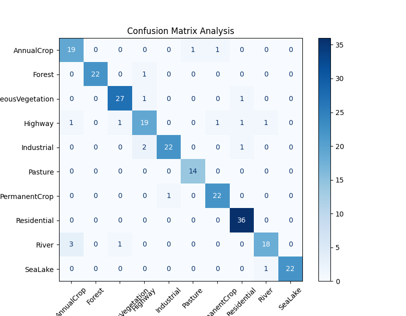
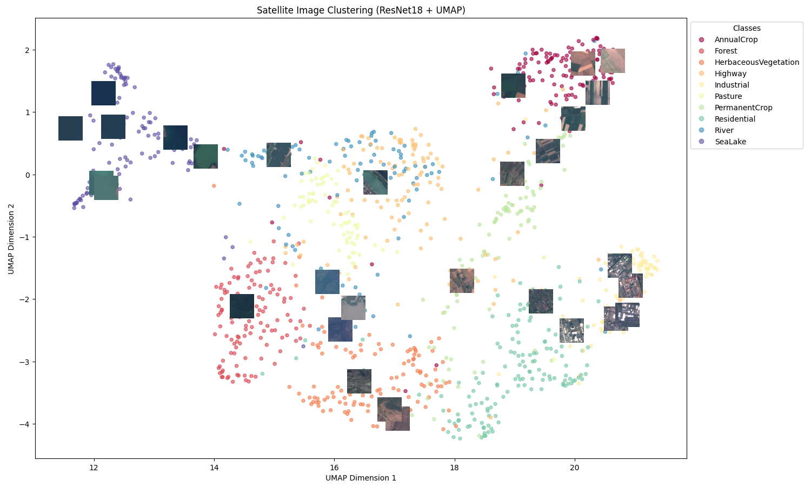

  <h1> Satellite Image Feature Extraction and Clustering 🛰️</h1>
  <h3>Using ResNet18 + UMAP + SVM</h3>
  
<b>Overall Model Accuracy: 92.08%</b>

<h2>1️⃣ Project Overview</h2>

This project focuses on analyzing satellite imagery by extracting deep features using a pre-trained <b>ResNet18</b> convolutional neural network, classifying the images using a <b>linear SVM</b>, and visualizing high-dimensional features in 2D using <b>UMAP</b>.

<h3>Core Components:</h3>
<ul>
  <li><b>CNN Feature Extraction:</b> Leveraging pre-trained ResNet18 for deep representations.</li>
  <li><b>Classification:</b> Training a linear SVM classifier on the extracted features.</li>
  <li><b>Evaluation:</b> Assessing model performance with a confusion matrix and accuracy score.</li>
  <li><b>Visualization:</b> Reducing features to 2D with UMAP, overlaying sample images on the scatter plot.</li>
</ul>

<blockquote>
  <b>💡 Use Case:</b> Useful for satellite image analysis, land cover classification, and exploratory data analysis in geospatial datasets.
</blockquote>

<h2>2️⃣ Dataset Details</h2>
<ul>
  <li><b>Structure:</b> EuroSAT-like folder system with subfolders for each class.</li>
  <li><b>Categories:</b> 
    AnnualCrop, Forest, HerbaceousVegetation, Highway, Industrial, Pasture, PermanentCrop, Residential, River, SeaLake.
  </li>
  <li><b>Preprocessing:</b> Images resized to <b>224x224</b> and normalized with ImageNet mean/std.</li>
</ul>

<h2>3️⃣ ⚙️ Installation & How to Run</h2>

<h3>Step 1: Clone the Repository</h3>
<pre><code>
git clone https://github.com/iamwajd/Satellite-Image-Analysis.git
cd Satellite-Image-Analysis
</code></pre>

<h3>Step 2: Install Dependencies</h3>
<pre><code>
pip install -r requirements.txt
</code></pre>

<h2>4️⃣ 🚀 Usage Example</h2>

To run the analysis, execute the <code>main.py</code> script. The program handles the full pipeline automatically.

<pre><code>
from main import SatelliteAnalyzer

# Initialize and run
analyzer = SatelliteAnalyzer(data_dir="./data")
features, labels, dataset, indices = analyzer.extract_features(sample_size=1200)
clf, X_test, y_test, preds = analyzer.train_classifier(features, labels)

# Display results
analyzer.plot_confusion(y_test, preds, dataset.classes)
analyzer.visualize_umap(features, labels, dataset, indices)
</code></pre>

<h2>5️⃣ Detailed Workflow</h2>

<h3>Step 1: Data Preprocessing</h3>
<ul>
  <li><b>Resizing & Normalization:</b> All satellite images are resized to <b>224x224</b> pixels to match ResNet18 input requirements.</li>
  <li><b>Normalization:</b> Applied ImageNet mean and standard deviation for better feature alignment.</li>
  <li><b>Sampling:</b> Randomly sampled <b>1200 images</b> to balance between statistical significance and memory efficiency.</li>
</ul>

<h3>Step 2: Deep Feature Extraction</h3>
<ul>
  <li><b>Model Architecture:</b> Utilized a pre-trained <b>ResNet18</b> model.</li>
  <li><b>Layer Truncation:</b> Removed the final fully connected (FC) layer to use the model as a pure feature extractor.</li>
  <li><b>Batch Processing:</b> Features are extracted in batches to optimize GPU/CPU utilization.</li>
</ul>

<h3>Step 3: Classification & Evaluation</h3>
<ul>
  <li><b>Data Splitting:</b> The dataset is split into <b>80% training</b> and <b>20% testing</b> sets.</li>
  <li><b>Linear SVM:</b> Trained a Support Vector Machine classifier on the high-dimensional feature vectors (512-D).</li>
  <li><b>Performance Metrics:</b> Generated a <b>Confusion Matrix</b> and calculated the overall accuracy.</li>
</ul>

<h3>Step 4: Dimensionality Reduction & Visualization</h3>
<ul>
  <li><b>UMAP Projection:</b> Reduced high-dimensional features to <b>2D space</b> using Uniform Manifold Approximation and Projection.</li>
  <li><b>Interactive Plot:</b> Created a scatter plot with representative image thumbnails overlaid to show clustering logic.</li>
</ul>

<h2>6️⃣ Results & Performance 📊</h2>

The model achieved an impressive overall accuracy of <b>92.08%</b>. Below is a detailed breakdown of the classification performance and feature distribution.

<h3>A. Confusion Matrix Analysis</h3>

The confusion matrix provides a granular view of how the Linear SVM performed across the 10 land-cover classes:

<ul>
  <li><b>High Precision Classes:</b> Categories like <b>SeaLake</b> and <b>Forest</b> show near-perfect classification, likely due to their distinct spectral and textural signatures.</li>
  <li><b>Inter-class Confusion:</b> Minor misclassifications are observed between <b>Highway</b> and <b>Residential</b> areas, which is expected given their similar urban features (pavement and structures).</li>
  <li><b>Performance:</b> The high diagonal values confirm the robustness of <b>ResNet18</b> as a feature extractor for geospatial data.</li>
</ul>

  

<h3>B. UMAP Feature Visualization</h3>

By reducing the 512-dimensional ResNet features to 2D, we can observe the natural "clustering" of the dataset:

<ul>
  <li><b>Clustering Quality:</b> Distinct, well-separated clusters indicate that the deep features extracted by the CNN are highly discriminative.</li>
  <li><b>Spatial Relationships:</b> Similar classes (like different types of vegetation) tend to group closer together in the UMAP space, while distinct classes (like Industrial vs. SeaLake) are far apart.</li>
  <li><b>Overlaying Images:</b> The plot includes sample image thumbnails to visually verify that the model correctly groups similar land-cover types.</li>
</ul>

  

<h2>7️⃣ Key Learnings & Skills</h2>
<ul>
  <li><b>Deep Learning:</b> Feature extraction with pre-trained CNNs.</li>
  <li><b>Machine Learning:</b> SVM classification on high-dimensional data.</li>
  <li><b>Data Science:</b> Dimensionality reduction using UMAP.</li>
  <li><b>Optimization:</b> Memory-efficient processing and batching.</li>
</ul>

<h2>8️⃣ Project Requirements</h2>
<ul>
  <li>Python ≥ 3.8</li>
  <li>PyTorch & torchvision</li>
  <li>scikit-learn</li>
  <li>umap-learn</li>
  <li>Matplotlib & NumPy</li>
</ul>
